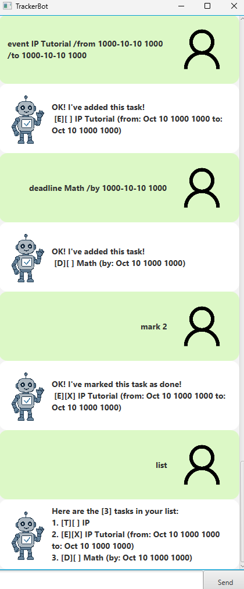

# TrackerBot User Guide



This is a **CLI/GUI enabled** application that allows users to manage their tasks.

## Features: 
1. [ToDos](#feature-adding-todos)
2. [Deadlines](#feature-adding-deadlines)
3. [Events](#feature-adding-events)
4. [List](#feature-listing-all-tasks)
5. [Mark / Unmark](#feature-mark-unmark-task)
5. [Delete](#feature-delete-task)
6. [Find](#feature-find)
7. [Sort](#feature-sort)

## Feature: Adding ToDos

Allows the user to add a generic task without time variables to the bot.

### Examples of usage
**Format**: `todo [Task Name]`

**Example**: `todo [CS2103T IP]`

A task with the specified name will be added to the bot.

```
[T][ ] CS2103T IP
```

## Feature: Adding Deadlines

Allows the user to add a task with a time variable as deadline.

### Examples of usage
**Format**: `deadline [Task Name] /by [YYYY-MM-DD HHMM]`

**Example**: `deadline [CS2103T IP] /by 1000-10-10 1000`

A task with the specified name will be added to the bot.

```
[D][ ] Math (by: Oct 10 1000 1000)
```


## Feature: Adding Events

Allows the user to add a task with a time variable as event start and event end.

### Examples of usage
**Format**: `event [Task Name] /from [YYYY-MM-DD HHMM] /to [YYYY-MM-DD HHMM]`

**Example**: `event [CS2103T IP] /from 1000-10-10 1000 /to 1000-10-10 1030`

A task with the specified name will be added to the bot.

```
[E][ ] CS2103T IP (from: Oct 10 1000 1000 to: Oct 10 1000 1030)
```

## Feature: Listing All Tasks

Allows the user to view all tasks.

### Examples of usage
**Format**: `list`

**Example**: `list`

All tasks stored will be viewed as a indexed list.

```
1. [T][ ] CS2103T IP
2. [D][ ] Math (by: Oct 10 1000 1000)
3. [E][ ] CS2103T IP (from: Oct 10 1000 1000 to: Oct 10 1000 1030)
```

## Feature: Mark/ Unmark Task

Allows the user to mark a task as completed or uncompleted.

### Examples of usage
**Format**: `mark/ unmark [index]`

**Example**: `mark 1`

The first task in the list will be marked as completed (mark) or uncompleted (unmark)

```
OK! I've marked this task as done!
1. [T][X] CS2103T IP

LIST
1. [T][X] CS2103T IP
2. [D][ ] Math (by: Oct 10 1000 1000)
3. [E][ ] CS2103T IP (from: Oct 10 1000 1000 to: Oct 10 1000 1030)
```

## Feature: Delete Task

Allows the user to delete a task from the storage.

### Examples of usage
**Format**: `delete [index]`

**Example**: `delete 1`

Task will be removed and not displayed in the list.

```
1. [D][ ] Math (by: Oct 10 1000 1000)
2. [E][ ] CS2103T IP (from: Oct 10 1000 1000 to: Oct 10 1000 1030)
```

## Feature: Find

Allows the user to view all tasks that contains the text to find.

### Examples of usage
**Format**: `find [text to find]`

**Example**: `find Math`

All tasks stored will be viewed as a indexed list.

```
1. [D][ ] Math (by: Oct 10 1000 1000)
2. [T][ ] Math Homework
3. [E][ ] Math Tutorial (from: Oct 10 1000 1000 to: Oct 10 1000 1030)
```

## Feature: Sort

Allows the user to sort all stored tasks in order of time priority.

### Examples of usage
**Format**: `sort`

**Example**: `sort`

All tasks stored will be sorted in order of time due/ event end.

```
1. [D][ ] Math (by: Oct 10 1000 1000)
2. [E][ ] Math Tutorial (from: Oct 10 1000 1000 to: Oct 10 1000 1030)
3. [T][ ] Math Homework
```

## Feature: Exit

Allows the user to exit the bot.

### Examples of usage
**Format**: `bye`

**Example**: `bye`

Closes the Bot

```
Bye. Hope to see you again soon!
```


